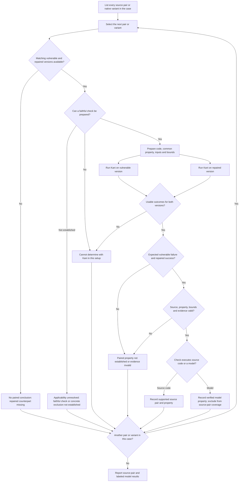

# Kani verification results

Kani checks Rust code against a written property over the inputs allowed by the test and its selected limits. It is property-directed verification, not a scanner that discovers every kind of vulnerability on its own.

The detailed tables list verified vulnerable/fixed source-pair checks and successful models that are explicitly labeled as models; the summary shows the full retained inventory and its source-pair testing coverage. A case can have several pairs, and each pair needs its own assessment. Each result applies to the behavior stated in its row and the inputs allowed by its check. It does not verify every representation in the case, the whole crate, or all possible inputs.

Datasets: [RustXec](../../manual/) · [HaluRust](../../halurust/) · [RustMizan](../../rustmizan/).

## Requirements

For a source pair to count as supported:

- An advisory and source history must establish the vulnerable behavior and repair.
- The selected retained code or authenticated corresponding upstream code, including its standard-library and dependency context, must preserve the behavior being checked.
- The selected code must run in a faithful Kani context; vulnerable and repaired source extracts alone are not executable proof targets.
- A bounded property must express a visible difference between the vulnerable and repaired states.
- The final vulnerable and repaired runs must use the same property, selected representation, assumptions, and limits.
- Kani must complete both runs: the vulnerable code violates the property and the repaired code satisfies it.
- The result, source inputs, limits, logs, and hashes must pass validation.

Rows marked **Model:** verify the stated source-derived model rather than execute the dataset code. A verified model property does not make a source pair supported or increase source-pair testing coverage. The reported results are not a detection-rate measurement.

Compilation alone is not verification. A build failure, unsupported operation, timeout, or missing faithful property does not show that a vulnerability label is wrong and does not establish that Kani could never test the case under a different faithful setup.

## Methodology

Version: cargo-kani 0.64.0. Verification engine: CBMC 6.6.0. One failing control and one passing control confirmed that the installed pipeline could report a counterexample and complete a successful proof.

Kani verifies a function marked `#[kani::proof]` against its assertions and enabled safety checks. Its [first-steps guide](https://model-checking.github.io/kani/tutorial-first-steps.html) explains how to set preconditions, call the selected code, and check the result. The study applied that workflow to vulnerable/repaired pairs as follows.

RustXec and HaluRust provide source pairs. RustMizan stores native crate/file/function projects rather than the same extracted-pair format: many have repaired counterparts, but some do not. For RustMizan, only matching context levels are paired; a missing repair is not invented. A single-version check cannot establish a vulnerable/repaired comparison, even if Kani finds a failure in the available version.

RustXec provides both files for every pair, but those files are extracted source items, not standalone Kani projects. Having both files is necessary but not sufficient: the selected operation still needs a faithful compilable context with the required types, traits, dependencies, and configuration. If that context cannot be prepared without inventing behavior, the pair does not count as tested.

The selected standard library and dependencies must also preserve the disclosed behavior. A later implementation that removes the failure path cannot establish the vulnerable/repaired difference, even when the retained source files match.

Results are tracked by dataset, case, pair, and property. Every matching pair received an individual feasibility assessment. Where a faithful property could be prepared, a check was attempted. Compilation, Kani support, and completion within the recorded bounds determined whether the attempt counted as a completed source-pair test. The resulting coverage reflects the recorded setup and completed outcomes, not a preselected sample of cases. Some unusable attempts had harness-target or configuration errors; those are experiment setup failures, not demonstrated Kani limitations. Vulnerable and repaired runs are matched within the same case and pair, with matching check code and bounds; results from different pairs are never combined. Each validated paired property result contributes to its own pair's coverage; grouping results under a case does not extend verification to the remaining pairs.

1. **Identify the available versions and behavior.** Select a source pair or native variant, then check whether matching vulnerable and repaired versions are available. Review the advisory, vulnerable source, and repair when present. Each pair needs its own applicable check; a successful check does not verify sibling pairs. If a faithful check cannot be prepared, the behavior cannot be determined with Kani in that setup.
2. **Prepare the code in working copies.** Use retained code, corresponding upstream code, or an explicitly stated source-derived model. Dataset files stayed unchanged. Add only the surrounding code needed to compile the selected operation and reach the disclosed behavior, without inventing behavior. The initial RustXec `cargo kani autoharness` pass checked build and generated-entry-point feasibility; it did not establish the case-specific vulnerable/repaired result.
3. **Write the same property for both versions.** Mark the check with `#[kani::proof]`, call the selected operation, and assert the required behavior. Inputs were supplied as a concrete trigger, a finite enumeration, or symbolic values from `kani::any()` restricted with `kani::assume()` when needed. These are examples of input construction, not features used by every check. Each result covers only its recorded inputs and assumptions.
4. **Set and preserve bounds.** Checks that needed loop bounds used `#[kani::unwind(...)]` or `--unwind`; these settings were not used by every check. Input sizes, bounds, and timeouts were recorded and held constant across each pair. Kani's [bounds guide](https://model-checking.github.io/kani/tutorial-loop-unwinding.html) explains these controls. An unwinding-assertion failure means an insufficient loop bound, not that the advisory's defect was reproduced. Changing the property, code boundary, assumptions, or limits creates a new experiment.
5. **Run and compare both versions.** Run the selected check with `cargo kani` on each version. The vulnerable version must fail for the expected behavior, and the repaired version must pass the same property. This includes checks of expected rejection behavior as well as memory or arithmetic failures. Expected-rejection checks used `#[kani::should_panic]`; their passing result was accepted only when raw output identified the intended repair guard and source location, following Kani's [attribute reference](https://model-checking.github.io/kani/reference/attributes.html#kanishould_panic). A compilation failure, reachable unsupported construct, timeout, or unrelated failed check cannot supply either side of a verified pair.
6. **Validate and record that pair.** Validate the captured outcomes, selected source, check identity, limits, logs, and hashes before adding its result. Kani's [result reference](https://model-checking.github.io/kani/verification-results.html) distinguishes successful, failed, unreachable, and undetermined checks; a successful summary can contain unreachable checks or a vacuous property. Interpret the result against the written inputs and behavior, then handle the next pair independently.

The flowchart describes the per-pair decision process, not evidence that every retained pair has a completed property check. It distinguishes a missing pair, an inconclusive check, and completed checks that do not establish the paired property. **Cannot determine with Kani in this setup** includes a build failure, reachable unsupported construct, timeout, insufficient loop bound, or relevant `UNDETERMINED` result. It is not a claim that Kani can never assess the case. None of these outcomes enters the verified tables. Applicability unresolved is a separate assessment: neither a faithful property check nor a concrete exclusion has been established.

## Results

**Cases** and **Pairs** are the retained inventory totals; a pair requires matching vulnerable and repaired versions. **Cases tested** counts cases with at least one completed pair test, not cases with every pair tested.

**Pairs tested** requires completed case-specific property runs on both versions, with matching check code and bounds and usable Kani outcomes. Builds, code generation, automatic-entry-point feasibility, timeouts, unsupported features, exhausted bounds, and one-sided results do not count.

**Pairs verified** further requires the expected vulnerable/fixed difference. Retained code and authenticated corresponding upstream code count; model checks do not count as source pairs tested or verified. Retries and additional properties do not increase pair counts. A dash means the complete pair inventory is not recorded.

| Dataset | Cases | Cases tested | Pairs | Pairs tested | Pairs verified |
| --- | ---: | ---: | ---: | ---: | ---: |
| RustXec | 96 | 27 | 176 | 37 | 35 |
| HaluRust | 57 | 18 | 57 | 18 | 18 |
| RustMizan | 37 | 15 | 67 | 30 | 30 |
| Total | 190 | 60 | 300 | 85 | 83 |

| Final pair assessment | Pairs |
| --- | ---: |
| Supported | 83 |
| Attempted without a supported source result | 85 |
| Unsuitable for the current Kani setup | 132 |
| Total matching pairs | 300 |

All 300 matching pairs received exactly one final assessment: 83 supported, 85 attempted, 132 unsuitable. Separately, 85 source pairs completed a comparable two-version check; 83 established the expected difference and 2 did not. The 9 successful model checks are attempted assessments, not source-tested pairs.

The other 215 pairs were not source-tested: 74 had incomplete or unusable source-property attempts, 132 were unsuitable, 9 were successful model checks. Models do not count as source checks. The recorded limitations include unsupported behavior, timeouts, insufficient bounds, external runtimes or FFI, compile-time-only behavior, physical resource exhaustion, and the absence of a faithful bounded representation. Unusable attempts also include harness-target and configuration errors; these do not establish a limitation of Kani.

All 17 vulnerable variants without a matching repair were assessed separately; these are not counted as pairs or included in the detailed tables.

The detailed tables contain the 83 verified source pairs and 9 successful models. For source-pair results, each case row names its verified pairs and shows their count against the available pair inventory. Model-only results do not increase that coverage. When several pairs share a row, each property keeps its pair name. **Verified** applies only to the listed properties, never to unlisted pairs or the whole case.

## RustXec

| Case | Pairs verified | What is being checked | Verified |
| --- | --- | --- | --- |
| RUSTSEC-2021-0003 | 1/1: insert_many | insert_many preserves [0, 2, 4, 123] for a zero-lower-hint iterator | Yes |
| RUSTSEC-2021-0022 | Model only: sub_self_call | Model: After the documented insufficient-buffer response requests growth, the variable descriptor passed on retry must point to the current Vec allocation | Yes |
| RUSTSEC-2021-0027 | 1/1: block_load | an 18-byte gzip header with BC/BSIZE=0 is rejected as corrupted before subtracting the header and extra-field length for Vec::set_len | Yes |
| RUSTSEC-2021-0028 | 1/1: insert_row | An ExactSizeIterator reporting one element cannot cause writes beyond TooDee storage | Yes |
| RUSTSEC-2021-0031 | 1/1: arena_split_at | ArenaSplit excludes the index already returned as a mutable reference despite changing Borrow answers | Yes |
| RUSTSEC-2021-0048 | 1/1: stackvec_extend | Reject misleading iterator hints before an out-of-storage write | Yes |
| RUSTSEC-2021-0063 | Model only: html_formatter_escape_href | Model: ampersand is not in the retained HREF_SAFE byte table and therefore reaches the href escape branch | Yes |
| RUSTSEC-2021-0069 | 1/1: client_codec_encode | a period at the start of an SMTP data line is doubled after repeated CRLF sequences split across frames | Yes |
| RUSTSEC-2021-0073 | 1/2: timestamp_normalize | normalize i64::MAX seconds plus 1_000_000_000 nanos without integer overflow; seconds saturate and nanos return to the subsecond range | Yes |
| RUSTSEC-2021-0079 | 1/1: chunked_read_size | A hex chunk-size step exceeding u64 is rejected instead of overflowing | Yes |
| RUSTSEC-2021-0081 | 2/3: chunked_read_extension, chunked_read_size | chunked_read_extension: Control characters in a chunk extension are rejected as invalid input chunked_read_size: oversized hexadecimal chunk size is rejected with InvalidInput before arithmetic overflow | Yes |
| RUSTSEC-2021-0115 | 1/1: zeroize_attrs_parse | Dropping an enum bearing the real zeroize(drop) derive attribute invokes its field Zeroize implementation | Yes |
| RUSTSEC-2021-0125 | 1/1: from_der_ | The upstream malformed UTCTime body is rejected without splitting a UTF-8 character | Yes |
| RUSTSEC-2021-0143 | 1/1: discard_exact | Report UnexpectedEof without repeating a zero-progress EOF poll | Yes |
| RUSTSEC-2022-0003 | 1/1: clean_text | Carriage return is escaped as &amp;#13; rather than HTML form-feed whitespace &amp;#12; | Yes |
| RUSTSEC-2022-0063 | 3/3: heap_extend, heap_new, hole_new | heap_extend: The free-list extent remains within the heap top after a one-byte adjacent extension heap_new: A valid static sixteen-byte heap beginning one byte after an aligned base must reject metadata that cannot fit after alignment hole_new: HoleList::new rejects a region smaller than the space needed for its in-band metadata | Yes |
| RUSTSEC-2023-0039 | 1/1: data_helper | Buffered bytes remain available after a partial read followed by an IO error | Yes |
| RUSTSEC-2023-0062 | 6/7: bit_string_from_content, oid_skip_if, oid_take_from, oid_take_opt_from, process_next_value, skip_opt | bit_string_from_content: A decoded empty bit string cannot retain a nonzero unused-bit count that underflows bit_len oid_skip_if: rejects truncated nested OID content without slicing beyond available bytes oid_take_from: An OID primitive with an incomplete final subidentifier is rejected as malformed oid_take_opt_from: rejects an OID ending with an unterminated base-128 subidentifier process_next_value: rejects a nested definite length larger than the remaining parent content skip_opt: rejects a primitive whose declared content extends past its enclosing sequence | Yes |
| RUSTSEC-2023-0077 | Model only: data_lense_macro | Model: a data lens accepts only a buffer whose length equals its declared field size | Yes |
| RUSTSEC-2023-0082 | 1/1: rfc3966_phone_number | an empty RFC3966 phone-context is handled without panicking | Yes |
| RUSTSEC-2023-0085 | Model only: update_max_dynamic_size | Model: malformed HPACK size updates are returned as an error rather than panicking | Yes |
| RUSTSEC-2024-0010 | 1/1: verify | a signature candidate shorter than the expected HMAC signature is rejected | Yes |
| RUSTSEC-2024-0021 | 1/1: context_drop_rest | After ownership transfer, context_drop_rest drops only the remaining original D field, not an E reinterpreted from it | Yes |
| RUSTSEC-2024-0335 | 1/1: prepare_invocation | A dash-prefixed SSH username must be rejected before becoming a command argument | Yes |
| RUSTSEC-2024-0336 | 1/2: process_alert | An unauthenticated CloseNotify warning must not set native CommonState.has_received_close_notify during the handshake | Yes |
| RUSTSEC-2024-0343 | 1/1: gen_macro | For every base62 index 0..61, the retained macro mask preserves that index instead of eliminating alphabet symbols | Yes |
| RUSTSEC-2024-0350 | 1/1: make_relative_path_current | The retained path stack rejects a/.. before treating parent traversal as a normal component | Yes |
| RUSTSEC-2024-0357 | Model only: mem_bio_get_buf | Model: zero-length slice creation must preserve Rust's non-null data-pointer invariant | Yes |
| RUSTSEC-2024-0363 | Model only: pg_hstore_encode_by_ref | Model: length conversion preserves the signed wire length and rejects values above i32::MAX | Yes |
| RUSTSEC-2024-0369 | 1/1: national_number_new | input at the documented 56-bit limit is rejected as Parse::TooLong rather than panicking or being accepted | Yes |
| RUSTSEC-2024-0437 | 1/1: skip_group | Three nested unknown protobuf groups must fail when the native configured recursion limit is two | Yes |
| RUSTSEC-2025-0015 | Model only: hyper_send, isahc_send | hyper_send: Model: Before reading payload, an HTTP response declaring 65537 bytes must not cause eager allocation above the repaired 64 KiB limit; bounded header-trust component, not a physical-OOM witness isahc_send: Model: Before body reads, Content-Length 65537 must not drive the isahc_send allocation prefix above the 64 KiB limit | Yes |
| RUSTSEC-2025-0018 | 2/2: get_bucket, get_chain | get_bucket: get_bucket rejects an index within bucket_count but beyond represented backing storage get_chain: get_chain rejects an index within chain_count but beyond represented backing storage | Yes |

## HaluRust

| Case | Pairs verified | What is being checked | Verified |
| --- | --- | --- | --- |
| CVE-2018-1000657 | 1/1: vulnerable.rs / fixed.rs | A reserve request that needs no physical growth must leave ring indices in bounds | Yes |
| CVE-2018-21000 | 1/1: vulnerable.rs / fixed.rs | Initialized byte length and capacity are preserved | Yes |
| CVE-2019-1010299 | 1/1: vulnerable.rs / fixed.rs | An empty iterator's Debug implementation must not format a value outside its logical range | Yes |
| CVE-2020-36318 | 1/1: vulnerable.rs / fixed.rs | The upstream make_contiguous regression must preserve ordered elements and valid ring indices | Yes |
| CVE-2021-28875 | Model only: vulnerable.rs / fixed.rs | Model: The read-reported count must not advance the initialized length beyond the supplied spare slice | Yes |
| CVE-2021-28877 | 1/1: vulnerable.rs / fixed.rs | Nested Zip access must add the inner iterator's consumed offset | Yes |
| CVE-2021-28879 | 1/1: vulnerable.rs / fixed.rs | Zip size_hint must not underflow after the side-effect-only next branch | Yes |
| CVE-2021-29511 | 1/1: vulnerable.rs / fixed.rs | An empty source slice does not expand Memory.data | Yes |
| CVE-2021-29922 | 1/1: vulnerable.rs / fixed.rs | Reject the upstream regression input 0127.0.0.1 as a noncanonical IPv4 address | Yes |
| CVE-2021-41153 | 1/1: vulnerable.rs / fixed.rs | A false JUMPI condition must advance without converting or validating the destination | Yes |
| CVE-2022-21685 | 1/1: vulnerable.rs / fixed.rs | Zero exponent with 33-byte exponent length does not underflow gas iteration accounting | Yes |
| CVE-2022-31100 | 1/1: vulnerable.rs / fixed.rs | A quoted non-ASCII scalar advances by its full UTF-8 width | Yes |
| CVE-2022-35922 | 1/1: vulnerable.rs / fixed.rs | A frame declaring nine payload bytes must be rejected when the configured maximum is eight bytes | Yes |
| CVE-2022-36008 | 1/1: vulnerable.rs / fixed.rs | Reject a malformed revert whose 32-byte ABI length cannot fit usize without overflowing the vulnerable byte sum | Yes |
| CVE-2023-22466 | 1/1: vulnerable.rs / fixed.rs | Changing pipe mode preserves the existing remote-client rejection bit | Yes |
| CVE-2023-28113 | 1/1: vulnerable.rs / fixed.rs | Reject remote Diffie-Hellman public key 1 before deriving or accepting a shared secret | Yes |
| CVE-2023-41051 | 1/1: vulnerable.rs / fixed.rs | A one-byte VolatileSlice must be rejected before a four-byte native VolatileRef load | Yes |
| CVE-2023-45812 | 1/1: vulnerable.rs / fixed.rs | Constructing a SupergraphResponse with the selected builder must return without panic | Yes |
| CVE-2023-46135 | 1/1: vulnerable.rs / fixed.rs | Reject u32::MAX payload length before padding arithmetic overflows | Yes |

## RustMizan

| Case | Pairs verified | What is being checked | Verified |
| --- | --- | --- | --- |
| vuln-0001 | 2/3: file, function | file: converting Buffer to Vec preserves the bytes and a single valid owner function: converting Buffer to Vec preserves the bytes and a single valid owner | Yes |
| vuln-0002 | 2/3: crate, file | crate: moving a MapGuard keeps its projected reference valid file: moving a MapGuard keeps its projected reference valid | Yes |
| vuln-0011 | 1/2: crate | finish keeps initialized values alive until the caller consumes them | Yes |
| vuln-0013 | 3/3: crate, file, function | crate: a safely initialized one-bit BitVec with excess capacity becomes a readable BitBox with the same bit value file: a safely initialized one-bit BitVec with excess capacity becomes a readable BitBox with the same bit value function: a safely initialized one-bit BitVec with excess capacity becomes a readable BitBox with the same bit value | Yes |
| vuln-0018 | 3/3: crate, file, function | crate: Chunk::unit must reject zero capacity before writing element zero file: Chunk::unit must reject zero capacity before writing element zero function: Chunk::unit must reject zero capacity before writing element zero | Yes |
| vuln-0019 | 3/3: crate, file, function | crate: Chunk::pair with capacity one must reject; vulnerable no-panic failure is a rejection-contract result, not a raw-pointer UB counterexample file: Chunk::pair with capacity one must reject; vulnerable no-panic failure is a rejection-contract result, not a raw-pointer UB counterexample function: Chunk::pair with capacity one must reject; vulnerable no-panic failure is a rejection-contract result, not a raw-pointer UB counterexample | Yes |
| vuln-0020 | 3/3: crate, file, function | crate: converting a two-element InlineArray into a one-element Chunk must reject; vulnerable no-panic failure is a rejection-contract result, not a raw-pointer UB counterexample file: converting a two-element InlineArray into a one-element Chunk must reject; vulnerable no-panic failure is a rejection-contract result, not a raw-pointer UB counterexample function: converting a two-element InlineArray into a one-element Chunk must reject; vulnerable no-panic failure is a rejection-contract result, not a raw-pointer UB counterexample | Yes |
| vuln-0023 | 3/3: crate, file, function | crate: InlineArray element storage is aligned for the stored element type file: InlineArray element storage is aligned for the stored element type function: InlineArray element storage is aligned for the stored element type | Yes |
| vuln-0024 | 1/2: crate | Slab::index rejects an index equal to allocated capacity before pointer dereference | Yes |
| vuln-0025 | 1/2: crate | removing the only element reads only allocated storage and returns it | Yes |
| vuln-0026 | 1/2: file | FAM deserialization rejects a header length that exceeds the decoded entry count | Yes |
| vuln-0027 | 1/2: crate | Reject an order-1 partition for a five-sample block | Yes |
| vuln-0039 | 1/2: crate | SmallVec::grow must restore the inline state when a spilled vector shrinks within inline capacity | Yes |
| vuln-0040 | 2/2: crate, function | crate: the existing malformed MP3 input returns an error rather than indexing out of bounds function: an escaped ID3 byte cannot be copied into an uninitialized output slot | Yes |
| vuln-0042 | 3/3: crate, file, function | crate: AsciiStr::first on an empty input does not dereference outside the slice file: AsciiStr::first on an empty input does not dereference outside the slice function: AsciiStr::first on an empty input does not dereference outside the slice | Yes |
